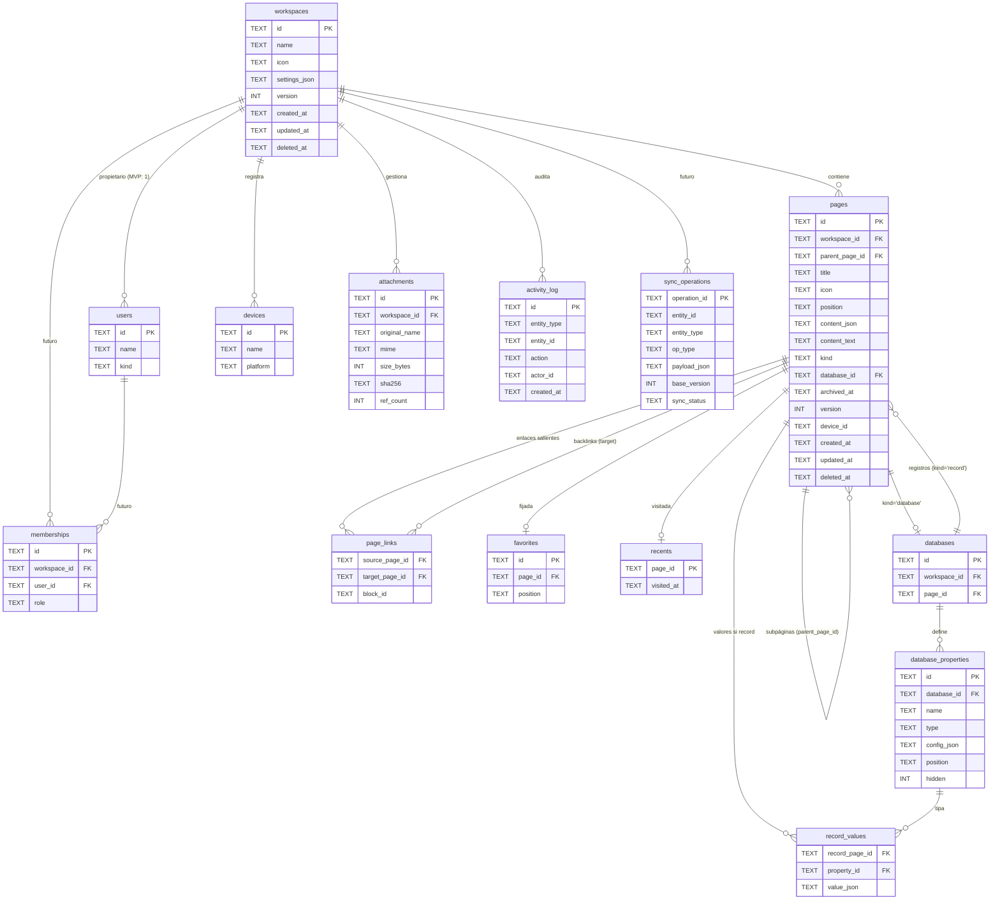

# ERD.md — Diagrama entidad-relación

Además existe `app.db` global (fuera del workspace) con `known_workspaces` y
`app_settings`, y la tabla virtual `pages_fts` (FTS5, contenido externo sobre
`pages`). Detalle de columnas en `docs/DATA_MODEL.md`.
